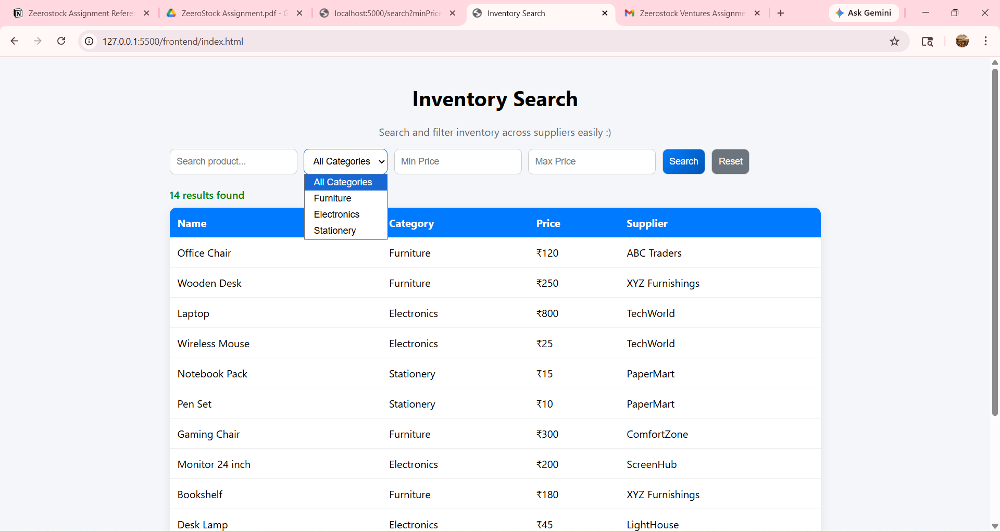
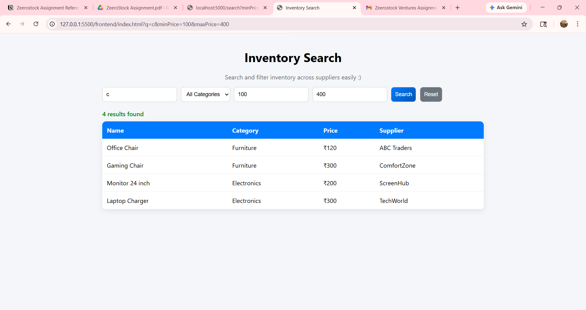
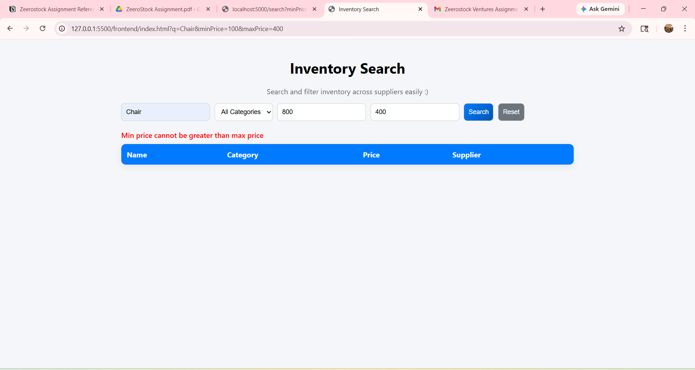
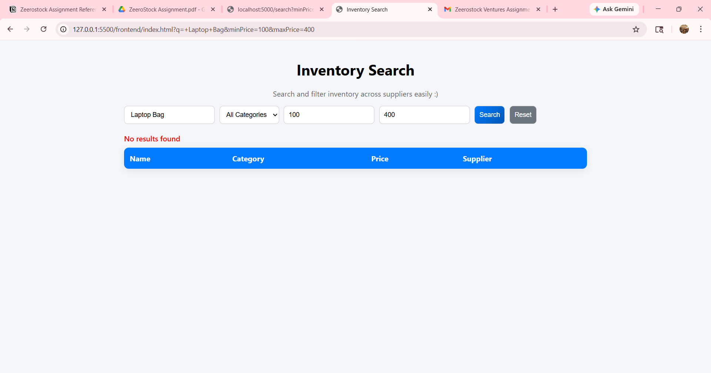
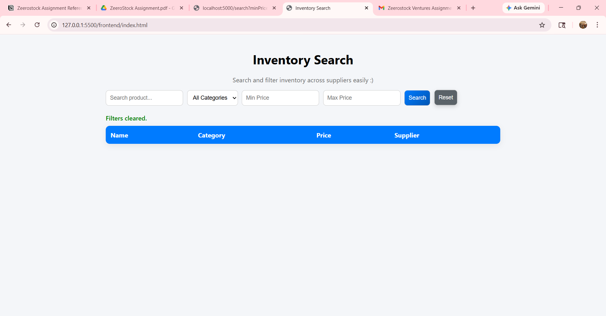

# Inventory Search API + UI (Part A) 

## 🔗 Live Demo
Frontend: https://your-project.vercel.app  
Backend: https://your-backend.onrender.com/search

---

## 🚀 Features (As per Assignment)

* Search products by name (case-insensitive)
* Filter by category
* Filter by price range (min & max)
* Combined filtering (search + category + price)
* Proper handling of edge cases:

  * Empty search query
  * Invalid price range
  * No matching results

* Clean and simple UI

---

## ✨ Add-ons / Enhancements

* Debounced search for better performance
* Reset filters button for improved UX
* URL query sync (filters reflected in URL & reload-safe)
* Loading indicator and styled error/success messages
* Input validation (prevents negative price values)
* Improved UX (disabled scroll changes on number inputs)

---

## 🔍 How Filtering Works

Filtering is performed on the backend using query parameters received from the client.

* `q` → filters products whose names include the search term
* `category` → matches exact category
* `minPrice` → includes products with price ≥ minPrice
* `maxPrice` → includes products with price ≤ maxPrice

All filters can be combined, and they are applied sequentially to return the final filtered dataset.
If no filters are provided, the API returns all inventory items.

---

## 🔤 Case-Insensitive Search

Case-insensitive search is implemented by converting both the product name and the search query to lowercase before comparison:

```js id="p8z2fk"
product.productName.toLowerCase().includes(q.toLowerCase())
```

This ensures that searches like `"chair"`, `"Chair"`, or `"CHAIR"` return the same results.

---

## ⚡ Performance Improvement (for Large Datasets)

To improve performance at scale, we would:

* Use **database indexing** on searchable fields (e.g., productName, category) to speed up queries.

---

## 💡 Future Improvements

* Implement pagination for large datasets
* Further optimize debounced search
* Integrate a full-text search engine (e.g., Elasticsearch)

---

## 🛠 Tech Stack

* Frontend: HTML, CSS, JavaScript
* Backend: Node.js, Express

---

## ▶️ Run Locally

### Backend

```bash id="4mtl4v"
cd backend
npm install
node server.js
```

### Frontend

Open `index.html` using Live Server or browser. 

--- 
 
## 📸 Screenshots

### Home Page UI



### Search Feature



### Handled Edge Cases 

<p>
  
  
</p> 

### Filters Cleared Feature 


